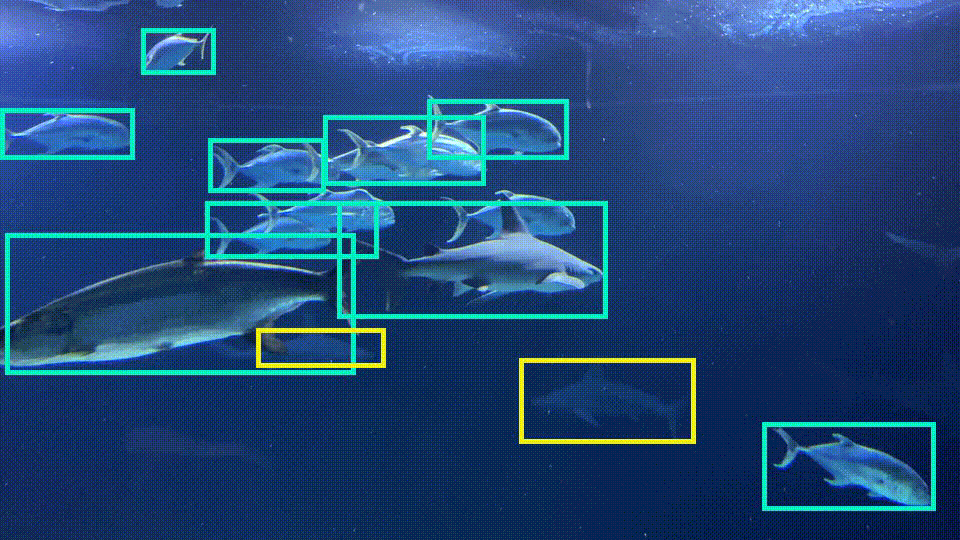

# Roboflow Video Inference
Example script to do inference on a video file with
[Roboflow Infer](https://docs.roboflow.com/inference/hosted-api)



An example video (gif) generated with this utility script from a Roboflow model
with the following command:

```
ROBOFLOW_KEY=xxxxxxxx ./infer.sh rf-aquarium-merged--3 IMG_3203.mov fish.gif --fps_in 3 --fps_out 12 --scale 4
```

## Installation

The shell script you need is [`infer.sh`](infer.sh) in this repo.

To use it
* copy that file to your local machine,
* add execute permissions `chmod +x infer.sh`,
* install the requirements (see below)
* and then use it:

```
# Simple usage with ROBOFLOW_KEY env var set inline
ROBOFLOW_KEY=xxxxx ./infer.sh xx-name--# video_in.mp4 video_out.mov
```

To obtain your `ROBOFLOW_KEY`, go to
[your account settings page](https://app.roboflow.com/account/api) and copy
your `API Key` (*not* your `Publishable Key`). Treat this API Key like a password;
it gives access to your Roboflow account and is meant to remain a secret.

The model ID (`xx-name--#` in the command above) is obtained from the Roboflow
UI after training. Click "Example Web App" in the "Use Your Trained Model" section
and copy it from the pre-filled text field at the top of the page.

## Requirements

The script's main requirements are [`ffmpeg`](https://www.ffmpeg.org/),
`base64`, and `curl`. On most modern Unix-like operating systems, you will only
need to install `ffmpeg` because the other requirements are preinstalled.

### macOS

Already includes `base64` and `curl`.

Use [`homebrew`](https://brew.sh/) to install ffmpeg: `brew install ffmpeg`

### Ubuntu

Already includes `base64` and `curl`.

Use `apt` to install ffmpeg: `sudo apt install ffmpeg`

### Windows

Download `ffmpeg` from [their website](https://www.ffmpeg.org/download.html) and
install [`git` for Windows](https://git-scm.com/downloads) which conveniently
includes `base64` and `curl`.

## Options

A `ROBOFLOW_KEY` environment variable with
[your Roboflow API Key](https://app.roboflow.com/account/api)
is required.

The [`infer.sh`](infer.sh) script accepts the following parameters:

| Parameter       | Example                          | Description
|    ---          |   ---                            |     ---
| `--host`        | `--host "http://localhost:9001"` | The Roboflow Infer host; set for [On-Device Inference](https://docs.roboflow.com/inference/nvidia-jetson) (default: `https://infer.roboflow.com`).
| `--confidence`  | `--confidence 50`                | The minimum threshold for the model to output box predictions (default: `50`).
| `--overlap`     | `--overlap 50`                   | The maximum amount two predicted boxes of the same class can intersect before being combined (default: `50`).
| `--stroke`      | `--stroke 5`                     | The thickness of the predicted bounding boxes (default: `5`).
| `--labels`      | `--labels`                       | Enable printing the class names (implicit default: off)
| `--classes`     | `--classes car`                  | A comma separated (no whitespace) list of classes to predict (default: show all).
| `--fps_in`      | `--fps_in 6`                     | The sample rate from the input video in frames per second (default: 6).
| `--fps_out`     | `--fps_out 24`                   | The render speed; setting higher than `fps_in` gives a timelapse effect (default: 24).
| `--scale`       | `--scale 2`                      | The amount to shrink the video; eg 2 to make video_out width and height 2x smaller than video_in (default: 1).
| `--tmp`         | `--tmp .`                        | The `tmp` directory; must be writable (default: `/tmp`).
| `--retries`     | `--retries 3`                    | The number of times to retry a failed inference (default: `3`).
| `--parallel`    | `--parallel 8`                   | The number of concurrent frames to send to the model (default: `8`).
| model           | `xx-mymodel--1`                  | The Roboflow model to use for inference (required).
| video_in        | `video_in.mp4`                   | The input video file (required).
| video_out       | `video_out.mp4`                  | The output video file (required). Can be of any format supported by `ffmpeg`'s encoder (eg `.mov`, `.mp4`, `.gif`).

## Building

[The infer script](infer.sh) is built with [`argbash`](https://argbash.io)
(a code generator that adds smart parameter parsing for bash scripts)
from [`source.m4`](source.m4).

To build, clone this repo, [install `argbash`](https://argbash.readthedocs.io/en/stable/install.html),
then run the following in the repo's top-level directory:

```
argbash source.m4 -o infer.sh
```

You can then use your newly generated [`infer.sh`](infer.sh) as described above.

## License

This example repo is released under an MIT License. You will need to train a model
with [Roboflow Train](https://docs.roboflow.com/train) which is goverened by
the [Roboflow Terms of Service](https://roboflow.com/terms).
